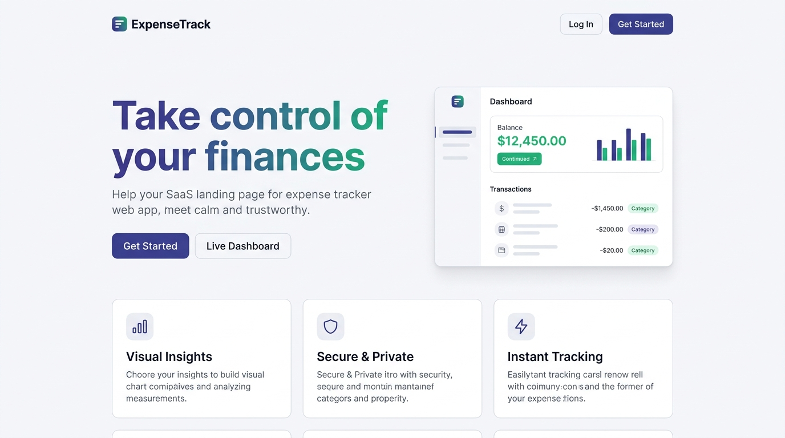
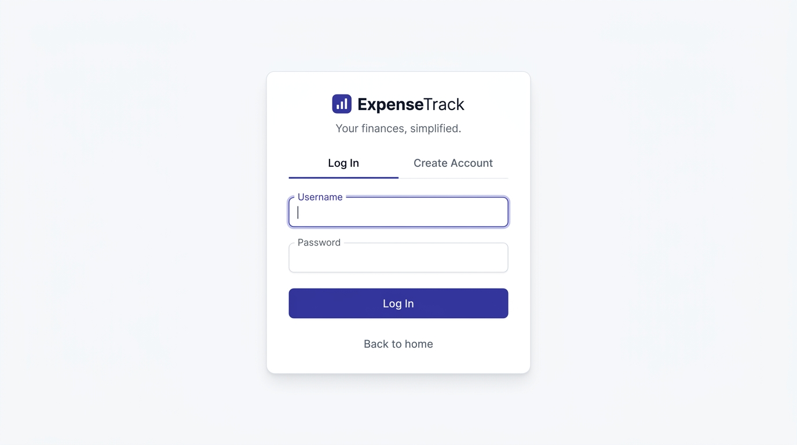
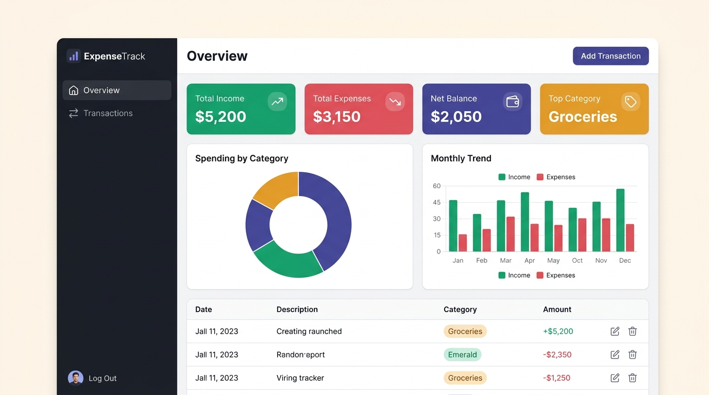

# ExpenseTrack — Full-Stack Expense Tracker

A polished, production-grade expense tracking application with a premium SaaS frontend and a RESTful Flask API, featuring token-based authentication, interactive charts, and spending summaries.

## Tech Stack

**Backend**
- Python, Flask
- SQLAlchemy ORM
- SQLite (local) / PostgreSQL via Neon (production)
- Token-based authentication (Bearer tokens)

**Frontend**
- Vanilla JavaScript SPA (no build step required)
- Custom CSS design system (Inter font, CSS custom properties)
- Chart.js for interactive spending visualizations
- Responsive design (mobile, tablet, desktop)

## Features

- **Landing Page** — Premium hero section, feature cards, and interactive dashboard preview
- **Authentication** — Login/register with inline validation, loading states, and friendly error messages
- **Dashboard** — Summary cards (Income, Expenses, Net Balance, Top Category), doughnut chart by category, bar chart for monthly trends
- **Transaction Management** — Full CRUD with slide-out drawer, sortable/filterable table, category badges, and delete confirmation modal
- **Toast Notifications** — Auto-dismissing success/error/info notifications with progress bars
- **Security Hardened** — XSS sanitization on all dynamic content, sessionStorage-only token storage, HTTP error code mapping (no raw stack traces exposed)
- **Normalized Schema** — Users → Categories → Transactions with foreign-key relationships
- **Summary Endpoint** — SQL aggregation (GROUP BY, SUM) with optional date filtering

## Screenshots

### Landing Page


### Authentication


### Dashboard


## Setup

```bash
git clone https://github.com/YOUR_USERNAME/expensetrack.git
cd expensetrack
python -m venv venv
venv\Scripts\activate        # Windows
pip install -r requirements.txt
python run.py
```

Server runs at `http://127.0.0.1:5000`

## Environment Variables

| Variable | Description | Default |
|---|---|---|
| `DATABASE_URL` | Database connection string | local SQLite file |
| `SECRET_KEY` | Flask secret key | dev default (change in production) |

## Frontend Architecture

The frontend is a single-page application served by Flask with no build step:

```
templates/
  index.html        # HTML shell with 3 views (landing, auth, dashboard)
static/
  style.css         # Design system (~820 lines) — tokens, components, responsive
  app.js            # SPA logic (~540 lines) — router, auth, CRUD, charts, toasts
```

**Design System**: Calm, premium aesthetic inspired by Linear/Stripe/Wise. Soothing neutral tones, emerald for income, rose for expenses, indigo for primary actions. Micro-animations, hover states, and skeleton loaders throughout.

**Security**: All user-generated text is sanitized before rendering. Tokens are stored in `sessionStorage` only (cleared on tab close). API errors are mapped to user-friendly messages — raw server errors are never exposed.

## API Endpoints

### Auth

**POST /api/register**
```json
Request:  {"username": "chinnu", "password": "test123"}
Response: {"message": "user created", "user_id": 1}
```

**POST /api/login**
```json
Request:  {"username": "chinnu", "password": "test123"}
Response: {"token": "c2b6c218..."}
```

All routes below require header: `Authorization: Bearer <token>`

### Categories

**GET /api/categories**
```json
Response: [{"id": 1, "name": "Groceries"}]
```

**POST /api/categories**
```json
Request:  {"name": "Groceries"}
Response: {"id": 1, "name": "Groceries"}
```

### Transactions

**GET /api/transactions**
Optional query param: `?category_id=1`
```json
Response: [{"id": 1, "amount": 45.5, "description": "Weekly groceries", "date": "2026-09-10", "category_id": 1}]
```

**POST /api/transactions**
```json
Request:  {"amount": 45.5, "description": "Weekly groceries", "category_id": 1, "date": "2026-09-10"}
Response: {"id": 1, "amount": 45.5, "description": "Weekly groceries", "date": "2026-09-10", "category_id": 1}
```

**PUT /api/transactions/\<id\>**
```json
Request:  {"amount": 50.0, "description": "Updated groceries"}
Response: {"id": 1, "amount": 50.0, "description": "Updated groceries", "date": "2026-09-10", "category_id": 1}
```

**DELETE /api/transactions/\<id\>**
```json
Response: {"message": "deleted"}
```

### Summary

**GET /api/summary?year=2026&month=9**
```json
Response: {
  "year": 2026,
  "month": 9,
  "by_category": [{"category": "Groceries", "total": 50.0}]
}
```

### Health

**GET /api/health**
```json
Response: {"status": "ok"}
```

## Testing

All endpoints tested manually via PowerShell `Invoke-RestMethod` and Postman. See `/postman` for the exported collection.

## Deployment

Deployed on Render with PostgreSQL (via Neon) using environment-based configuration for `DATABASE_URL` and `SECRET_KEY`. The frontend requires no separate build or deployment — it's served directly by the Flask app.